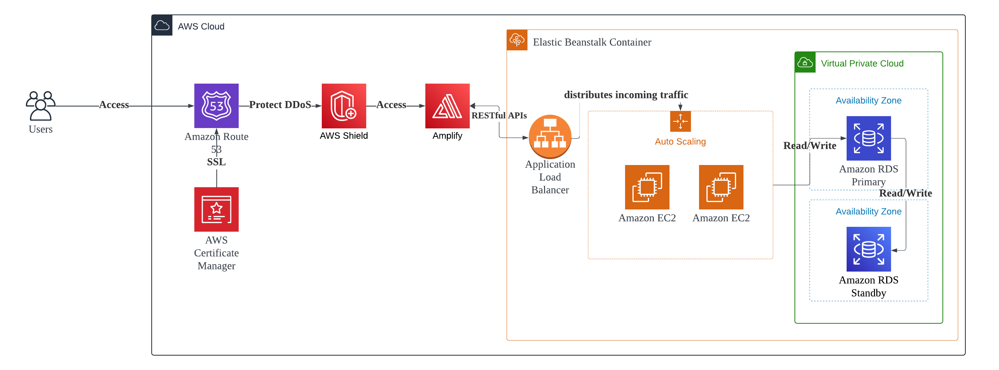

# WrenGuard Backend

Welcome to the backend repository for WrenGuard, the innovative platform aimed at protecting endangered grasswrens in Australia. This repository contains all the necessary server-side code and resources needed to support our conservation efforts.

## Technology Stack

The back-end is developed using **Node.js** with the **Express.js** framework, providing a robust server-side platform. Key packages include:
- **Node.js**: The runtime environment for executing JavaScript on the server.
- **Express.js**: Version 4.18.2, a minimal and flexible Node.js web application framework that provides robust features for web and mobile applications.
- **Axios**: For making HTTP requests.
- **Dotenv**: Version 16.3.1, for loading environment variables from a .env file.
- **Cors**: Version 2.8.5, for enabling Cross-Origin Resource Sharing.
- **MySQL**: Version 2.18.1, for database interactions.

Development dependencies include Nodemon for automatic server reloading during development.

## Getting Started

Back-end Startup Instructions:

- Navigate to the back-end project directory.
- Install necessary dependencies using `npm install`.
- Start the server using `npm start`, or use `npm run dev` for a development environment with hot reloading enabled (Configured with Nodemon).

Note: Please ensure the environment variables are configured correctly.

```
DB_HOST=""
DB_PORT=""
DB_USERNAME=""
DB_PASSWORD=""
GOOGLE_MAPS_API_KEY=""
OPEN_WEATHER_API_KEY=""
```

## API Integrations

### Google Maps API (Geocoding)
- **Purpose**: Converts user-inputted postcodes into geographic coordinates (latitude and longitude).
- **Integration**: The API is called from the Node.js back-end whenever a user submits a postcode.
- **URL**: [Google Maps Geocoding API](https://maps.googleapis.com/maps/api/geocode/json)
- **Security and Configuration**: The API key is securely stored in the AWS Elastic Beanstalk environment properties, ensuring it is not exposed in the codebase.

### OpenWeather API
- **Purpose**: Provides real-time and future weather data to enhance the accuracy of our predictive models for Grasswren habitat analysis. Including weather data helps us understand how changing climate conditions might affect these habitats.
- **Integration**: Integrated into the data processing pipelines within the back-end. It fetches weather data based on the geographic coordinates obtained from our database or through the Google Maps Geocoding API.
- **URL**: [OpenWeather API](https://api.openweathermap.org/data/3.0/onecall?lat={lat}&lon={lon}&exclude={part}&appid={API key})
- **Security and Configuration**: API calls are secured with keys stored as environment variables in AWS Elastic Beanstalk, preventing unauthorized access and ensuring data integrity.

## AWS System Architecture Diagram


An Easy Overview of the AWS Configuration

---

© 2024 WrenGuard. All Rights Reserved.
